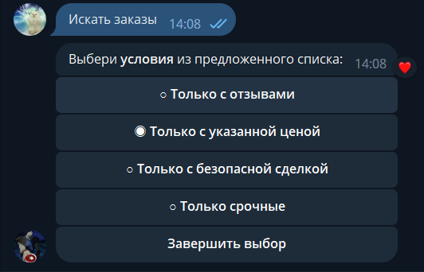

<h1>habr-freelance-parser</h1>
#python

<b>Бот-парсер</b> для сервиса <b><a href="https://freelance.habr.com">Хабр Фриланс</a></b> в <b>Telegram.</b> Оперативный и быстрый поиск заказов для фрилансеров.

<b>Bot-parser</b> for service <b><a href="https://freelance.habr.com">Habr Freelance</a></b> in <b>Telegram.</b> Prompt and fast search for orders for freelancers.

<b>Команды / commands</b>  

<b>Условия / conditions</b>  

<b>Запрос и результат / Request and result</b>  

